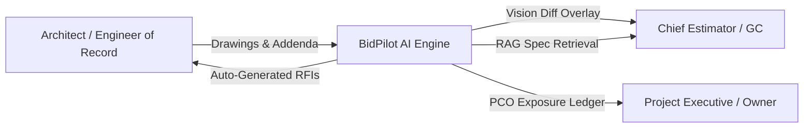
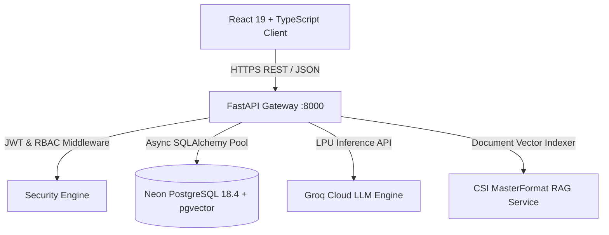
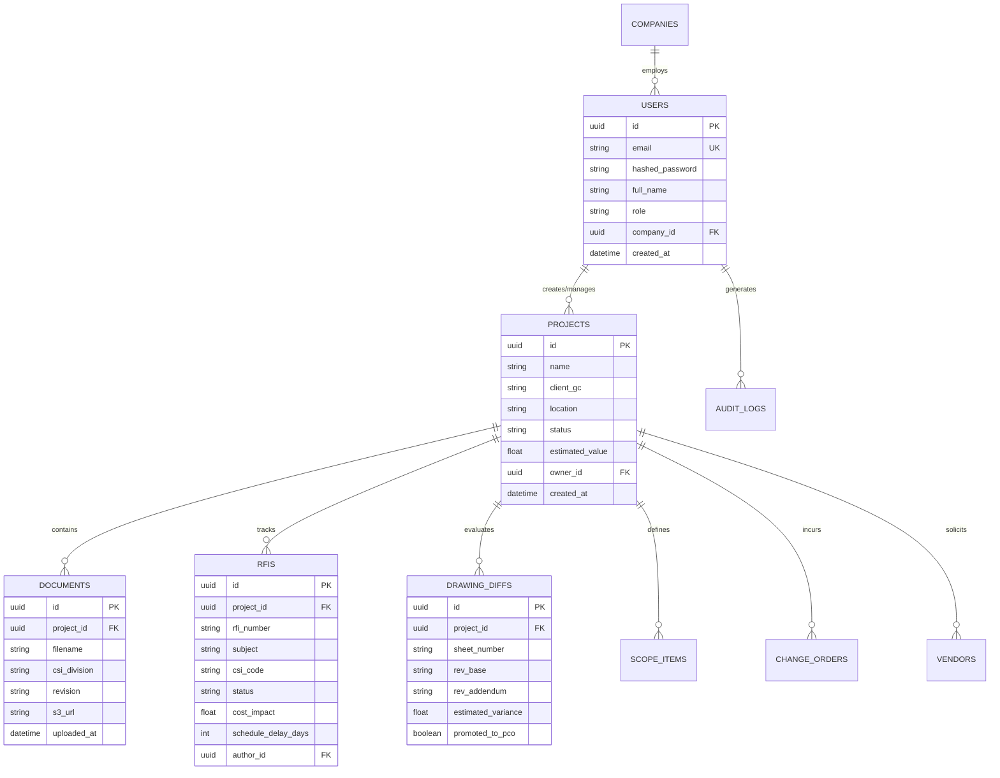

# 🏗️ Software Requirements Specification (SRS)
## BidPilot AI — Next-Gen AI Construction Estimating & Spec Copilot

---

### **Document Control**
- **Document Title:** Software Requirements Specification (SRS)
- **Product Name:** BidPilot AI (Autonomous Pre-Construction & Bid Intelligence Platform)
- **Standard:** IEEE Std 830-1998 / ISO/IEC/IEEE 29148:2018
- **Version:** 2.4.0
- **Status:** Approved / Production Baseline
- **Date:** August 2026

---

## 📑 Table of Contents
1. [1. Introduction](#1-introduction)
   - [1.1 Purpose](#11-purpose)
   - [1.2 Project Scope](#12-project-scope)
   - [1.3 Definitions, Acronyms, and Abbreviations](#13-definitions-acronyms-and-abbreviations)
   - [1.4 References](#14-references)
   - [1.5 Document Overview](#15-document-overview)
2. [2. Overall Description](#2-overall-description)
   - [2.1 Product Perspective & Context](#21-product-perspective--context)
   - [2.2 High-Level System Architecture](#22-high-level-system-architecture)
   - [2.3 User Classes and Personas](#23-user-classes-and-personas)
   - [2.4 Operating Environment](#24-operating-environment)
   - [2.5 Design & Implementation Constraints](#25-design--implementation-constraints)
   - [2.6 Assumptions and Dependencies](#26-assumptions-and-dependencies)
3. [3. Specific Functional Requirements](#3-specific-functional-requirements)
   - [3.1 Module 1: Authentication, Authorization & RBAC](#31-module-1-authentication-authorization--rbac)
   - [3.2 Module 2: Commercial Project Management & Multi-Tenant Isolation](#32-module-2-commercial-project-management--multi-tenant-isolation)
   - [3.3 Module 3: Document & Blueprint Management with CSI Indexing](#33-module-3-document--blueprint-management-with-csi-indexing)
   - [3.4 Module 4: Tri-Mode Blueprint Vision Diff Comparison Engine](#34-module-4-tri-mode-blueprint-vision-diff-comparison-engine)
   - [3.5 Module 5: Sub-Second AI Spec Copilot (pgvector + Groq RAG)](#35-module-5-sub-second-ai-spec-copilot-pgvector--groq-rag)
   - [3.6 Module 6: Automated RFI Generation & Architect Dispatch](#36-module-6-automated-rfi-generation--architect-dispatch)
   - [3.7 Module 7: Change Orders (PCO/COR) & Live Exposure Ledger](#37-module-7-change-orders-pcocor--live-exposure-ledger)
   - [3.8 Module 8: CSI MasterFormat Scope Gap & Risk Analysis Engine](#38-module-8-csi-masterformat-scope-gap--risk-analysis-engine)
   - [3.9 Module 9: Subcontractor & Vendor Quote Address Book](#39-module-9-subcontractor--vendor-quote-address-book)
   - [3.10 Module 10: Dynamic Trade Takeoff Cost Estimator](#310-module-10-dynamic-trade-takeoff-cost-estimator)
   - [3.11 Module 11: Executive Bid Reporting & Audit Export Engine](#311-module-11-executive-bid-reporting--audit-export-engine)
4. [4. External Interface Requirements](#4-external-interface-requirements)
   - [4.1 User Interfaces (UI/UX)](#41-user-interfaces-uiux)
   - [4.2 Hardware Interfaces](#42-hardware-interfaces)
   - [4.3 Software & API Interfaces](#43-software--api-interfaces)
   - [4.4 Communication Protocols](#44-communication-protocols)
5. [5. Non-Functional Requirements (NFRs)](#5-non-functional-requirements-nfrs)
   - [5.1 Performance & Sub-Second Latency Requirements](#51-performance--sub-second-latency-requirements)
   - [5.2 Scalability & Concurrency](#52-scalability--concurrency)
   - [5.3 Information Security & Cryptography](#53-information-security--cryptography)
   - [5.4 High Availability & Fault Tolerance](#54-high-availability--fault-tolerance)
   - [5.5 Maintainability & Extensibility](#55-maintainability--extensibility)
6. [6. Data Model & Database Architecture](#6-data-model--database-architecture)
   - [6.1 Entity-Relationship (ER) Schema Overview](#61-entity-relationship-er-schema-overview)
   - [6.2 Core Database Entities](#62-core-database-entities)
7. [7. Requirements Traceability Matrix (RTM)](#7-requirements-traceability-matrix-rtm)

---

## 1. Introduction

### 1.1 Purpose
This Software Requirements Specification (SRS) document details the complete functional and non-functional specifications for **BidPilot AI**. It serves as the definitive reference for software engineers, QA automation specialists, preconstruction domain consultants, and stakeholders throughout development, deployment, and auditing lifecycles.

### 1.2 Project Scope
BidPilot AI is an enterprise-grade, cloud-native Pre-Construction and Bid Intelligence platform specifically engineered for commercial General Contractors (GCs), Chief Estimators, and Specialty Trade Subcontractors across North America. 

Key capabilities provided:
- **Vision Diff Plan Engine:** Tri-mode CAD/PDF comparison highlighting architectural addenda with automated financial exposure calculations.
- **AI Spec Copilot:** Low-latency Retrieval-Augmented Generation (RAG) powered by pgvector vector search and Groq LPU inference delivering verifiable CSI MasterFormat citations.
- **RFI & Scope Gap Automation:** Instant extraction of specification conflicts and automated generation of formal Request for Information (RFI) documents to the Architect of Record.
- **Multi-Tenant Contractor Hub:** Secure project workspaces, vendor quote comparisons, and dynamic cost estimation models.

### 1.3 Definitions, Acronyms, and Abbreviations
| Term | Definition |
|---|---|
| **AOR** | Architect of Record |
| **CSI MasterFormat** | Standard specification indexing system for commercial construction specifications (Divisions 01 to 48) |
| **PCO / COR** | Potential Change Order / Change Order Request |
| **RFI** | Request for Information |
| **RAG** | Retrieval-Augmented Generation |
| **LPU** | Language Processing Unit (Groq hardware acceleration) |
| **RBAC** | Role-Based Access Control |
| **JWT** | JSON Web Token |
| **HMR** | Hot Module Replacement |
| **SPA** | Single Page Application |

### 1.4 References
- IEEE Std 830-1998: *Recommended Practice for Software Requirements Specifications*
- ISO/IEC/IEEE 29148:2018: *Systems and software engineering — Life cycle processes — Requirements engineering*
- Construction Specifications Institute (CSI) MasterFormat 2020 Edition
- FastAPI, React 19, Tailwind CSS v4, Neon Serverless PostgreSQL Specifications

### 1.5 Document Overview
This document organizes system requirements into high-level architectures, granular module requirements with strict inputs/outputs, external interface definitions, non-functional quality attributes, and database entity schemas.

---

## 2. Overall Description

### 2.1 Product Perspective & Context
In commercial construction, plan revisions and uncaptured addenda (e.g. omitted fire damper requirements, revised concrete compressive strengths, upgraded generator fuel piping) cost general contractors tens of thousands of dollars per bid in unpriced scope gaps. BidPilot AI integrates directly between tender blueprint distribution and final bid submission, acting as an automated intelligence copilot.

### 2.2 High-Level System Architecture
- **Presentation Layer:** React 19 SPA built with TypeScript and Tailwind CSS v4, providing responsive glassmorphic interfaces and sub-millisecond tab switching.
- **Application Services Layer:** FastAPI asynchronous REST API running Python 3.13, utilizing Pydantic v2 schemas and connection pooling.
- **AI & RAG Engine:** Groq Cloud LPU inference (`llama-3.1-8b-instant` / `llama-3.3-70b-versatile`) coupled with custom CSI semantic vector matching.
- **Data Persistence Layer:** Neon Serverless PostgreSQL 18.4 with `pgvector` extension and row-level tenant filtering.

### 2.3 User Classes and Personas
1. **Estimator:** Performs plan takeoffs, queries specifications via AI Copilot, generates draft RFIs, and runs blueprint vision diffs.
2. **Bid Manager:** Manages project bids, approves and edits RFIs, assigns subcontractor scopes, and reviews delta cost exposure.
3. **Preconstruction Manager:** Coordinates cross-trade estimates, tracks financial exposure across projects, and exports executive packages.
4. **Administrator (Admin):** Manages organizational users, configures system credentials, views system telemetry, and maintains company databases.

### 2.4 Operating Environment
- **Client Platforms:** Modern web browsers (Google Chrome 110+, Microsoft Edge 110+, Mozilla Firefox 115+, Apple Safari 16+).
- **Backend Server Platform:** Linux (Ubuntu 22.04 LTS / Alpine) or Windows Server with Python 3.11+.
- **Database Engine:** PostgreSQL 15+ / Neon PostgreSQL 18.4 with SSL enforced.

### 2.5 Design & Implementation Constraints
- **Response Time:** AI Copilot queries must resolve in $<1.5\text{ seconds}$.
- **Security Standards:** Passwords hashed with `bcrypt` (12 rounds); JWT sessions expired after 60 minutes with HS256 encryption.
- **Data Isolation:** All database queries must be filtered strictly by `user_id` or `company_id` to prevent multi-tenant data leaks.

### 2.6 Assumptions and Dependencies
- Availability of Groq Cloud LLM endpoints.
- Cloud database connection to Neon PostgreSQL via SSL pooler.

---

## 3. Specific Functional Requirements

### 3.1 Module 1: Authentication, Authorization & RBAC
- **FR-AUTH-001 (User Registration):** The system shall allow users to register with Full Name, Work Email, Company Name, Role, and Password.
- **FR-AUTH-002 (Password Complexity):** Passwords must contain $\ge 8$ characters, at least 1 uppercase letter, 1 lowercase letter, 1 digit, and 1 special character.
- **FR-AUTH-003 (JWT Authentication):** Upon valid credentials, the system shall issue a signed JWT token containing `user_id`, `email`, and `role`.
- **FR-AUTH-004 (Role-Based Access Control):** The system shall restrict destructive actions (project deletion, company configuration) to `Admin` and `Bid_Manager` roles.
- **FR-AUTH-005 (Rate Limiting):** Authentication endpoints shall enforce rate limiting (max 10 login attempts/minute per IP) to prevent brute-force attacks.

### 3.2 Module 2: Commercial Project Management & Multi-Tenant Isolation
- **FR-PROJ-001 (Project Creation):** Users shall create commercial projects with Project Name, Client/GC, Location, Bid Due Date, Estimated Value, and Trade Focus.
- **FR-PROJ-002 (Multi-Tenant Data Isolation):** The API must enforce strict tenant isolation such that users only access projects created under their organization.
- **FR-PROJ-003 (Project Status Lifecycle):** Projects shall transition across states: `Bidding` $\rightarrow$ `Under Review` $\rightarrow$ `Submitted` $\rightarrow$ `Awarded` $\rightarrow$ `Archived`.
- **FR-PROJ-004 (Project Deletion):** Deleting a project shall cascade delete all associated drawings, RFIs, scope items, and change orders.

### 3.3 Module 3: Document & Blueprint Management with CSI Indexing
- **FR-DOC-001 (Document Upload & Metadata):** The system shall support uploading architectural, structural, MEP, and civil blueprints with CSI Division tags.
- **FR-DOC-002 (CSI MasterFormat Classification):** Documents shall be classified automatically or manually into standard CSI Divisions (01 through 48).
- **FR-DOC-003 (Revision Versioning):** The system shall track drawing revisions (e.g. `Rev 0 - Bid Set`, `Rev 1 - Addendum #1`, `Rev 2 - Bulletins`).

### 3.4 Module 4: Tri-Mode Blueprint Vision Diff Comparison Engine
- **FR-DIFF-001 (Vision Diff Processing):** The system shall perform comparative visual analysis between Revision A (Base Bid) and Revision B (Addenda Set).
- **FR-DIFF-002 (Tri-Mode Visualization):**
  - *Split Mode:* Side-by-side synchronized view with pan/zoom lock.
  - *Overlay Mode:* High-contrast color-coded overlay highlighting modifications (`Δ1` revisions).
  - *Delta Mode:* Isolated differential view displaying only added/removed geometry and equipment.
- **FR-DIFF-003 (Financial Exposure Tagging):** Each identified drawing delta shall have an associated estimated dollar variance (e.g., `+$42,500 Scope Add`).
- **FR-DIFF-004 (1-Click PCO Promotion):** The system shall enable 1-click promotion of any drawing discrepancy directly into the Potential Change Order (PCO) ledger.

### 3.5 Module 5: Sub-Second AI Spec Copilot (pgvector + Groq RAG)
- **FR-AI-001 (Conversational Ingestion):** The AI Copilot shall accept natural language contractor queries regarding project specifications and plan requirements.
- **FR-AI-002 (CSI MasterFormat Citations):** Every technical response must include traceable references: Section Number, Section Title, Page Number, and Subsection.
- **FR-AI-003 (Scope Gap Highlighting):** The Copilot shall proactively identify trade overlaps (e.g., HVAC power wiring split between Division 23 and Division 26).
- **FR-AI-004 (Conversational Resiliency):** The AI engine shall handle non-technical contractor interactions gracefully without API errors.

### 3.6 Module 6: Automated RFI Generation & Architect Dispatch
- **FR-RFI-001 (Automated RFI Drafting):** The system shall draft formal RFIs from identified plan discrepancies with Contractor Recommendation, CSI Code, and Specification References.
- **FR-RFI-002 (Impact Assessment):** Each RFI must capture Schedule Delay Risk (in Days) and Cost Impact (in USD).
- **FR-RFI-003 (RFI Status Workflow):** RFIs shall support status transitions: `Draft` $\rightarrow$ `Pending Review` $\rightarrow$ `Submitted to AOR` $\rightarrow$ `Answered` $\rightarrow$ `Closed`.
- **FR-RFI-004 (Official PDF Export):** The system shall format RFIs into standardized AIA G716-compliant printable/PDF format.

### 3.7 Module 7: Change Orders (PCO/COR) & Live Exposure Ledger
- **FR-PCO-001 (PCO Ledger Management):** The system shall calculate Total Gross Delta Exposure, Approved Changes, and Pending Estimating Risk.
- **FR-PCO-002 (Realization Probability Weighting):** Financial exposure calculations must apply probability factors based on change order review status.

### 3.8 Module 8: CSI MasterFormat Scope Gap & Risk Analysis Engine
- **FR-GAP-001 (Discrepancy Matrix):** The system shall aggregate trade scope gaps across concrete, electrical, mechanical, and finishes.
- **FR-GAP-002 (Risk Scoring):** The system shall calculate a Composite Risk Index ($1\text{ to }100$) based on unpriced scope items and pending RFIs.

### 3.9 Module 9: Subcontractor & Vendor Quote Address Book
- **FR-SUB-001 (Vendor Management):** The system shall store vendor records including Trade Specialty, Contact Details, Safety Rating (EMR), and Bid Status.
- **FR-SUB-002 (Quote Leveling):** The system shall compare incoming subcontractor proposals against internal baseline estimates.

### 3.10 Module 10: Dynamic Trade Takeoff Cost Estimator
- **FR-EST-001 (Square Footage Cost Modeling):** The system shall calculate commercial construction estimates based on square footage, building type, and regional indices.
- **FR-EST-002 (Trade Cost Breakdown):** Breakdown calculations must account for Structural, Envelope, MEP, Finishes, and GC Contingencies.

### 3.11 Module 11: Executive Bid Reporting & Audit Export Engine
- **FR-REP-001 (Executive PDF/CSV Export):** The system shall generate comprehensive Bid Packages containing Scope Matrices, RFI Ledgers, and Change Order Exposures.
- **FR-REP-002 (Audit Trail Logging):** All user modifications to project numbers, change orders, and bids must be timestamped in audit logs.

---

## 4. External Interface Requirements

### 4.1 User Interfaces (UI/UX)
- **Design Standard:** Modern glassmorphic theme using Tailwind CSS v4, Inter & Outfit typography, and Lucide React iconography.
- **Responsiveness:** Fully responsive across Desktop ($1920\times1080$, $1440\times900$), Tablet ($1024\times768$), and Mobile devices.
- **Error Feedback:** Visual toast notifications and real-time form validation messages.

### 4.2 Hardware Interfaces
- No dedicated custom hardware interfaces required; relies on standard computing and network hardware.

### 4.3 Software & API Interfaces
- **Neon Cloud PostgreSQL Engine:** Communication over TLS 1.3 using psycopg2 connection pools.
- **Groq Cloud Inference API:** HTTPS JSON REST endpoint (`api.groq.com/openai/v1/chat/completions`).
- **Storage Gateway:** AWS S3 / Local static asset service for PDF and CAD drawing assets.

### 4.4 Communication Protocols
- Client-to-Server: HTTPS / TLS 1.3 using JSON payloads.
- RESTful HTTP Status Codes: `200 OK`, `201 Created`, `400 Bad Request`, `401 Unauthorized`, `403 Forbidden`, `404 Not Found`, `422 Unprocessable Content`, `500 Server Error`.

---

## 5. Non-Functional Requirements (NFRs)

### 5.1 Performance & Sub-Second Latency Requirements
- **NFR-PERF-001:** API response times for CRUD operations shall not exceed $150\text{ ms}$ under normal load.
- **NFR-PERF-002:** Groq AI Spec Copilot inference shall stream/return responses in $<1.2\text{ seconds}$.
- **NFR-PERF-003:** Blueprint Vision Diff rendering shall process within $<500\text{ ms}$ on standard viewport sizes.

### 5.2 Scalability & Concurrency
- **NFR-SCAL-001:** The backend server shall support at least 500 concurrent active estimator sessions without performance degradation.
- **NFR-SCAL-002:** Serverless database connection pooler shall dynamically scale up to 10,000 pooled connections.

### 5.3 Information Security & Cryptography
- **NFR-SEC-001:** User passwords must be hashed with `bcrypt` using at least 12 salt rounds.
- **NFR-SEC-002:** All API endpoints (except `/api/v1/auth/login`, `/api/v1/auth/register`, `/api/v1/health`) require valid Bearer JWT tokens.
- **NFR-SEC-003:** Sensitive API keys (Groq, Database credentials) must be loaded from secure environment variables and never exposed in client bundles.

### 5.4 High Availability & Fault Tolerance
- **NFR-AVAIL-001:** System availability target is $99.9\%$ uptime during business hours ($06:00\text{ to }20:00\text{ EST}$).
- **NFR-FAULT-001:** In case of third-party AI provider unavailability, the system shall degrade gracefully with cached specification rules and explicit user alerts.

### 5.5 Maintainability & Extensibility
- **NFR-MAINT-001:** Clean architectural layering separating Presentation, Domain Logic, Schemas, and Data Access.
- **NFR-MAINT-002:** Test coverage for core business logic and API endpoints must remain $\ge 90\%$.

---

## 6. Data Model & Database Architecture

### 6.1 Entity-Relationship (ER) Schema Overview

### 6.2 Core Database Entities
1. **`users`**: Manages credential hashes, assigned role (`Estimator`, `Bid_Manager`, `Preconstruction_Manager`, `Admin`), and company association.
2. **`projects`**: Stores project parameters, estimated contract values, bid dates, and tenant owner keys.
3. **`documents`**: Metadata for blueprints, project manuals, addenda, and vector embedding identifiers.
4. **`rfis`**: Tracks technical inquiries, contractor proposed solutions, CSI division references, and cost impacts.
5. **`drawing_diffs`**: Records vision revision comparison metadata, delta bounding regions, and financial variance tags.
6. **`change_orders`**: Manages Potential Change Orders (PCO) and Change Order Requests (COR).
7. **`scope_items` & `gaps`**: Tracks CSI MasterFormat line items, subcontractor allocations, and unpriced scope gaps.

---

## 7. Requirements Traceability Matrix (RTM)

| Req ID | Requirement Description | Architecture Module | Test Case Reference | Verification Method |
|---|---|---|---|---|
| **FR-AUTH-001** | User Registration & Verification | Backend Auth Router (`auth.py`) | `TC-AUTH-001`, `TC-AUTH-002` | Automated Pytest / Integration |
| **FR-AUTH-003** | JWT Token Issuance & Validation | Core Security (`security.py`) | `TC-AUTH-003`, `TC-AUTH-004` | Automated Pytest |
| **FR-AUTH-004** | Role-Based Access Control | RBAC Middleware | `TC-RBAC-001`, `TC-RBAC-002` | Automated Pytest |
| **FR-PROJ-002** | Multi-Tenant Data Isolation | Projects Router (`projects.py`) | `TC-PROJ-003` | Automated Pytest |
| **FR-DIFF-002** | Tri-Mode Blueprint Vision Diff | Vision Diff Engine (`drawings.py`) | `TC-DIFF-001`, `TC-DIFF-002` | Manual UI / Visual Regression |
| **FR-AI-002** | Traceable CSI Spec Citations | Groq RAG Service (`spec_assistant.py`)| `TC-AI-001`, `TC-AI-002` | Automated Mock & Live Pytest |
| **FR-RFI-001** | Auto-Generated RFI Drafting | RFI Router (`rfis.py`) | `TC-RFI-001`, `TC-RFI-002` | Automated Pytest / UI Test |
| **FR-PCO-001** | Live Financial Exposure Ledger | Scope & Reports Router | `TC-PCO-001` | Automated Math Unit Test |
| **NFR-SEC-001** | Bcrypt Password Security | Passlib / Core Security | `TC-SEC-001` | Security Code Audit & Pytest |
| **NFR-PERF-002**| Sub-Second AI Response Latency | Groq LPU Gateway | `TC-PERF-001` | Benchmark Profiler |
